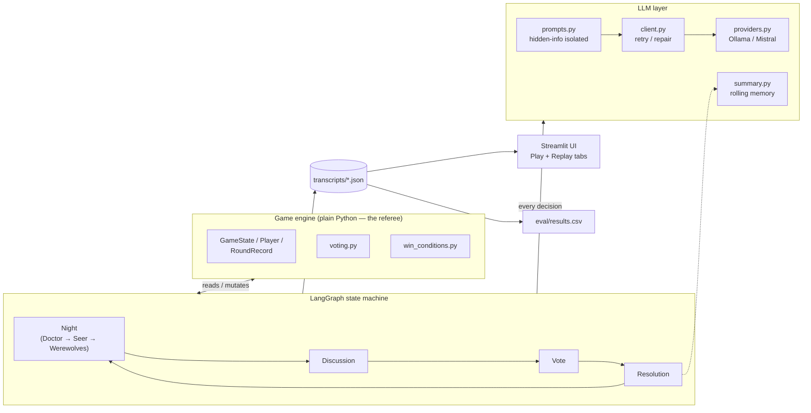
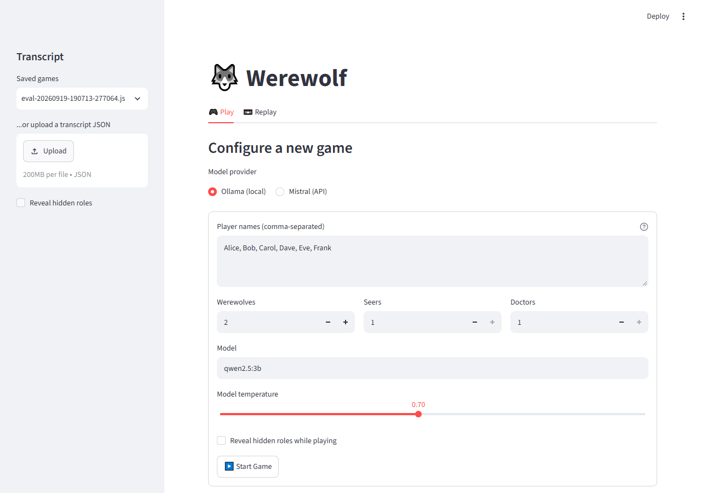
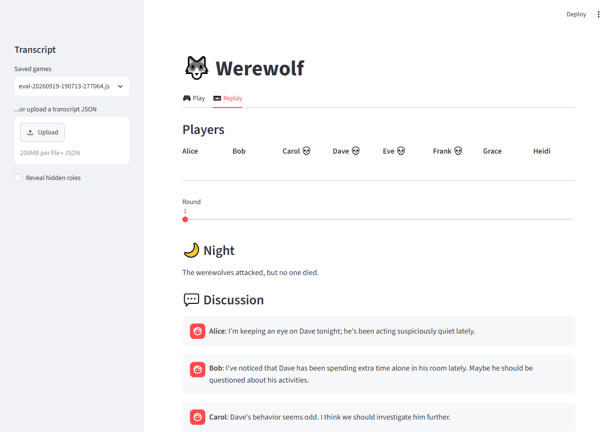
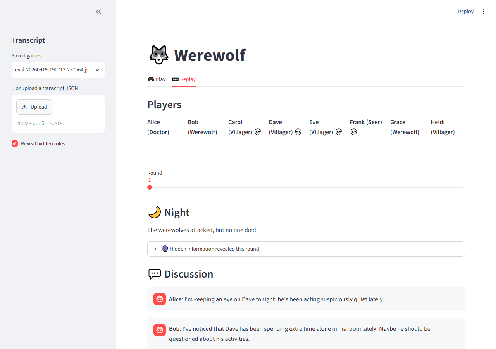
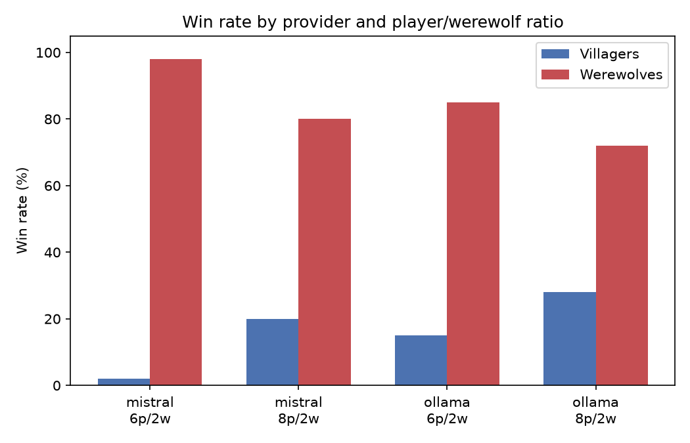
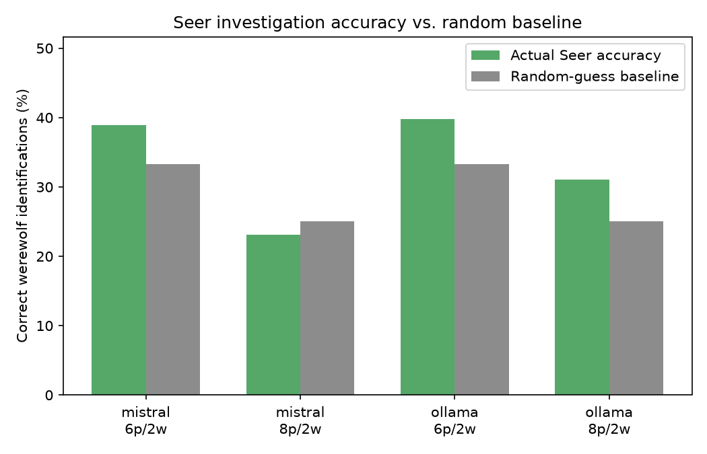

# AI Werewolf: Self-Play Agent Simulation

LLM-driven agents play **Werewolf** (a.k.a. Mafia) against each other — hidden roles, private knowledge, and a moderator that only ever reveals what a player is actually allowed to know. Built to show multi-agent orchestration, hidden-state isolation, structured decision-making, and evaluation, with a local-first, low-cost development loop.

Play (and watch) a game live, or replay any saved one, from a Streamlit app:

```
uv run streamlit run src/ai_werewolf/ui/app.py
```

## Architecture

The design leans on one rule throughout: **never trust an LLM to referee the game**. A plain-Python engine owns all state and enforces every rule; LLMs only ever *decide*, through validated structured output.



**Hidden information is structural, not just prompted.** Each `Player` has a private `private_log` — e.g. a Seer's investigation results — that only *that player's own* prompt ever reads. Villagers never see werewolf identities, werewolves never see Seer/Doctor actions, and none of it leaks into the public game log. This is enforced in code and covered directly by tests (`tests/test_hidden_information.py`), not just assumed from prompt wording.

**Every agent decision is a validated Pydantic schema**, not free text. `client.py` wraps every LLM call: if the model returns malformed JSON *or* a rule-violating choice (voting for a dead player, investigating yourself), the concrete error is fed back to the model and it's asked to try again.

**Memory is a rolling summary, not a growing transcript.** Every prompt reads a compact summary of earlier rounds plus only the events since it was last updated — so a 10-round game doesn't mean a 10-round prompt.

## The app

| Play a game live | Replay (roles hidden) | Replay (roles revealed) |
|---|---|---|
|  |  |  |

The **Play** tab configures and runs a game live, streaming each night/discussion/vote as it happens and auto-saving the finished game. The **Replay** tab steps through any saved transcript round by round, with a toggle to reveal real roles and any Seer investigations for that round — off by default, so it reads the way a player would actually experience it.

## Sample transcript

From a real 8-player Mistral game. The Seer (Grace) privately identifies a werewolf (Bob) — but never says so out loud, and Bob still gets voted out anyway, on unrelated social pressure:

> **Grace's private knowledge** (never shown to anyone else): *"Round 2: you investigated Bob (id 1) — they ARE a Werewolf."*
>
> **Bob**: "I'm really shaken by Alice's death. It's clear we're dealing with a dangerous player among us... Who else feels like we're being targeted?"
>
> **Dave**: "I'd like to hear from Grace and Heidi again — Heidi, you mentioned an alibi with Grace last night. Can you both share more details?"
>
> **Grace**: "Heidi and I were together last night, and I stand by that alibi. However, given the recent losses, I think we need to focus less on alibis and more on the actions of those who consistently push narratives without evidence. Bob, you've mentioned patterns — can you share what you've observed?"
>
> **Round 2: Bob was voted out.**

That gap — correct private information that never becomes public reasoning — turned out to be a pattern worth measuring (see below).

## Evaluation

155 real games across two providers and two player/werewolf ratios (`ai_werewolf.eval_batch`, results in `eval/results.csv`):




| | Mistral 6p/2w | Mistral 8p/2w | Ollama 6p/2w | Ollama 8p/2w |
|---|---|---|---|---|
| Werewolves win rate | 98% | 80% | 85% | 72% |
| Villagers win rate | 2% | 20% | 15% | 28% |
| Werewolves caught | 17% | 28% | 20% | 44% |
| Avg. rounds played | 1.8 | 2.8 | 1.6 | 3.0 |
| Seer investigation accuracy | 39% | 23% | 40% | 31% |

**Findings:**
- **Werewolves dominate at low villager-team ratios.** At 6 players / 2 werewolves, villagers only need to whiff *one* day vote to hit parity — and mostly do. Moving to 8 players / 2 werewolves roughly 10x'd Mistral's villager win rate (2% → 20%) and nearly doubled Ollama's (15% → 28%), simply by giving villagers more rounds to recover from a bad vote. This is a game-balance effect, not a model-quality one.
- **Seer accuracy tracks close to the random-guess baseline** (2 werewolves out of N players) rather than exceeding it — at 6 players both models sit slightly above baseline (~39-40% vs. 33%), but at 8 players Mistral actually falls *below* baseline (23% vs. 25%). Combined with the transcript above, this suggests current agents aren't yet choosing investigation targets strategically, and even correct information doesn't reliably surface into public reasoning.

Run your own batch:
```
uv run python -m ai_werewolf.eval_batch --games 50 --provider mistral --players 8 --werewolves 2
uv run python -m ai_werewolf.eval_report
```

## Tech stack

- **Python 3.12**, managed with **uv**
- **LangGraph** — the Night → Discussion → Vote → Resolution state machine
- **Ollama** (`qwen2.5:3b`) — free, local model for development
- **Mistral API** (`mistral-small-latest`) — hosted model for higher-quality showcase games
- **Pydantic** — structured, validated schemas for every agent decision
- **Streamlit** — the Play/Replay app
- **LangSmith** — tracing, wired in via env vars only (see `.env.example`)
- **pandas** — evaluation reporting
- **pytest** — 54 tests covering the engine, LLM retry/repair logic, LangGraph routing, hidden-information isolation, persistence, and the Streamlit app itself (via `streamlit.testing.v1.AppTest`)

## Project structure

```
src/ai_werewolf/
  engine/       rule-enforcing game state: roles, players, voting, win conditions
  graph/        LangGraph nodes + the Night/Discussion/Vote/Resolution wiring
  llm/          prompts, Pydantic schemas, retry/repair client, provider factory, memory
  ui/           Streamlit app: play.py (live), replay.py (saved games), rendering.py (shared)
  cli.py        run a single game from the terminal
  eval_batch.py run N games, append metrics to eval/results.csv
  eval_report.py  summarize eval/results.csv
  persistence.py  save/load game transcripts as JSON
tests/          pytest suite (engine, LLM, graph, hidden-info, persistence, UI)
scripts/        one-off repo tooling (eval chart generation) — not part of the shipped package
Plans/          the original project plan this was built from
```

## Getting started

```bash
uv sync
ollama pull qwen2.5:3b        # local model for free development

uv run python -m ai_werewolf.cli                       # one game, local model
uv run python -m ai_werewolf.cli --provider mistral     # one game, Mistral API (needs MISTRAL_API_KEY in .env)
uv run streamlit run src/ai_werewolf/ui/app.py          # the web app
uv run pytest                                           # the test suite
```

## Known limitations

- Only one Doctor is ever consulted per night even if more than one is configured — a latent limitation of the current setup, not something the eval batches above exercise.
- The Seer doesn't yet reason strategically about *who* to investigate (see Evaluation above) — a natural next step would be conditioning its target choice on the discussion so far.
- Claude Haiku was part of the original plan for a "showcase quality" provider but was intentionally skipped — it requires a paid API key. The provider layer (`llm/providers.py`) is already built to make adding it a small, self-contained change.
